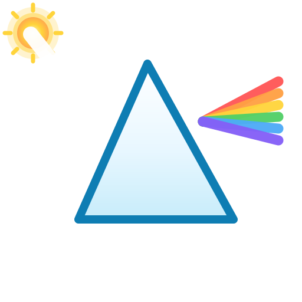
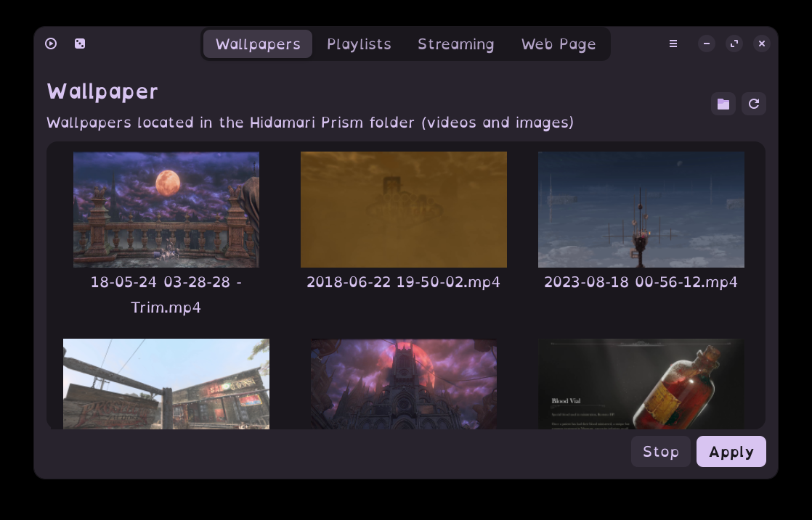

<p align="center"></p>

<p align="center">Video and image wallpaper for Linux. Written in Python. 🐍</p>
<p align="center">Hidamari_Prism 日溜まり【ひだまり】(n) sunny spot; exposure to the sun</p>

<div align="center">
  
  <a href="https://ko-fi.com/swordberry"></a>
</div>

# Hidamari_Prism　ーひだまりー

> **This is a fork of [Hidamari](https://github.com/jeffshee/hidamari)**
> Original Hidamari was created by [Jeff Shee](https://github.com/jeffshee).
> This project is developed **with the help of AI**. See the [License & credits](#license--credits) section below.

If you like this fork, please consider supporting its development!

[](https://ko-fi.com/swordberry)

Also please don't forget to click that star button! 🌟  
Your support is truly appreciated!

## What's new in this fork ✨

- **Static image wallpapers** *(GNOME)* — use images as wallpapers, with zero rendering or decoding overhead.
- **Playlists** — bundle wallpapers into playlists and switch between them, or add an entire folder at once. When shuffle is **off**, the playlist plays **in order** and loops; when shuffle is on it picks randomly.
- **Pause & mute when maximized** — the wallpaper pauses automatically when a window is maximized or fullscreen.
- **Per-monitor pause & mute** — only the screen behind a maximized/fullscreen window pauses; your other monitors keep animating (X11), and a window dragged to another screen pauses that screen's wallpaper on GNOME Wayland.
- **GNOME Wayland support** — pause/mute on maximize works on Wayland through a tiny bundled GNOME Shell extension (opt-in with confirmation).
- **Searchable wallpapers & playlists** — find a wallpaper instantly from a search bar in both tabs; the playlist dropdown tracks the window width instead of overflowing.
- **Power-friendly defaults** — hardware-accelerated decoding by default with automatic CPU fallback; see [Performance](#performance--hardware-compatibility-).
- **Multi-monitor tuned** — per-monitor decoders and graceful hot-plug handling.
- **Fork branding, credits and donate links added**, with the original GPL-3.0 license retained.

## Which Linux does it run on? 🖥️

Hidamari Prism is made for **Linux** and ships as a Flatpak, so it runs on any
distribution that supports Flatpak — Fedora, Ubuntu, Arch, openSUSE, and just
about anything else.

- **X11 — fully supported on every desktop** (GNOME, KDE Plasma, XFCE, Cinnamon,
  and any other window manager). Video, stream, and web-page wallpapers work
  everywhere, and pause/mute-when-maximized works on any X11 desktop through the
  window manager. Static-image wallpapers and restoring the original wallpaper
  are GNOME-only.
- **GNOME on Wayland — fully supported**, including pause/mute when maximized
  through a tiny opt-in GNOME Shell extension (installed with your
  confirmation).
- **KDE Plasma, Sway, and other Wayland compositors** — video, stream, and
  web-page wallpapers play in a plain window; the window-state toggles and
  static-image wallpapers are no-ops there. Run an X11 session for the full
  experience.

## Features 🔥

There are several solutions to achieve video as wallpaper on Linux, for example:

1. [Xwinwrap + mpv](https://www.linuxuprising.com/2019/05/livestream-wallpaper-for-your-gnome.html)
2. [Komorebi](https://github.com/cheesecakeufo/komorebi)

Hidamari_Prism offers similar feature as above, with additional features listed below:

- [x] Autostart after login
- [x] Apply static wallpaper with blur effect <sup>1</sup>
- [x] Static **image** wallpapers <sup>7</sup>
- [x] Wallpaper **playlists**, with in-order or shuffle playback <sup>8</sup>
- [x] Detect maximized window and fullscreen mode <sup>2</sup>
- [x] Volume control
- [x] Mute/Pause the playback anytime with just 2 clicks!
- [x] I'm feeling lucky <sup>3</sup>
- [x] Hardware accelerated video decoding! <sup>4</sup>
- [x] Gnome Wayland support!
- [x] Multi-monitor support!
- [x] Streaming URL support! <sup>5</sup>
- [x] Webpage as wallpaper! <sup>6</sup>
- [ ] You name it! =)

<sup>1</sup> Video frame can be applied as system wallpaper, look great in <i>GNOME</i> (currently GNOME exclusive, support for other DE might be added if requested...)  
<sup>2</sup> Automatically pauses playback when maximized window or full screen mode is detected. Works on X11 out of the box; on <i>GNOME Wayland</i> the first time you enable it, Hidamari Prism asks for permission, installs a tiny bundled GNOME Shell extension, and the feature takes effect after you restart your session once. On other Wayland desktops it stays hidden.  
<sup>3</sup> Randomly select and play a video  
<sup>4</sup> Use <i>vlc</i> as backend. On <i>NVIDIA + Wayland</i> hardware decoding requires the host's <i>nvidia-vaapi-driver</i>; otherwise it automatically falls back to CPU decoding     
<sup>5</sup> Use <i>yt-dlp</i> as backend, tested with YouTube videos  
<sup>6</sup> Theoretically it can be anything from a normal webpage to <i>Unity/Godot WebGL games</i>, be creative!  
<sup>7</sup> Any image in your wallpaper folder can be set as a static wallpaper with a blur effect (currently GNOME-only).  
<sup>8</sup> Create playlists from your wallpaper folder, add entire folders at once, and toggle <i>shuffle</i>. Turn shuffle off for a perfectly ordered, looping sequence. This is a fork feature.

## Installation ⏬
### Flatpak 📦
Build the Flatpak bundle from source (see `build-flatpak.sh` and `pkgs/flatpak`), then install it:

#### Command line instructions
Install:  
```
flatpak install --user hidamari_prism-wallpapers.flatpak
```
Run:  
```
flatpak run io.github.swordberry.Hidamari_Prism
```
You can also find it in the **Zorin OS Software store**.

## Screenshot 📸

<p align="center">
  <video src="res/demo.mp4" controls preload="metadata" muted></video>
</p>

<p align="center">
  <a href="res/demo.mp4">▶ Watch the full-resolution demo video (mp4, ~39 MB)</a>
</p>



## Performance & hardware compatibility ⚡

Hidamari_Prism is built to run well on as many machines as possible while
keeping CPU and power usage low:

- **Hardware video decoding by default.** Supported GPUs decode with the
  graphics card instead of the CPU, which dramatically cuts CPU load and power
  draw during playback:
  - **Intel & AMD** → VA-API
  - **NVIDIA (X11)** → VDPAU / VA-API
  - **NVIDIA + Wayland** → VA-API when the host ships
    [`nvidia-vaapi-driver`](https://github.com/elFarto/nvidia-vaapi-driver),
    otherwise it uses CPU decoding automatically.
  - If a driver is unstable, set **Hardware acceleration** to *Auto*
    (default) so it automatically falls back to CPU decoding when the GPU
    decoder glitches, or to *Off* to force software decoding.
- **Automatic fallback.** In *Auto* mode, if the GPU decoder fails at runtime
  (`get_buffer() failed` / `no frame!` on some drivers), playback seamlessly
  switches to the CPU — one wallpaper for every machine, no user action.
- **Sensible defaults.** Playback pauses automatically when a window is
  maximized or a fullscreen app is open, so the wallpaper doesn't burn CPU/GPU
  while you're working. On GNOME Wayland this uses a tiny bundled GNOME Shell
  extension that you opt into (one-time, with confirmation) and that becomes
  active after a session restart.
- **Per-monitor efficiency.** Every display gets its own decoder, and monitor
  hot-plug/unplug is handled without restarting the player or fighting the
  compositor.

### Flatpak permissions

The Flatpak only grants what it needs: network (streams), the video folders for
reading wallpapers, and GPU acceleration (`--device=dri`). It never touches your
home directory wholesale.

## Please!! 🙏

Collaboration is welcome! Let's make it better together~  
Feel free to open an issue if you have any problem or suggestion 🤗  

Icons made by [Freepik](http://www.freepik.com/) from [Flaticon](https://www.flaticon.com)

## License & credits ⚖️

- **Hidamari Prism** is a fork of [Hidamari](https://github.com/jeffshee/hidamari) by [Jeff Shee](https://github.com/jeffshee), released under the **GPL-3.0-or-later** license (see [COPYING](COPYING)).
- This fork was developed **with the help of AI**, and builds on the ideas, code, and design of the original project. 日溜まり means "sunny spot" — a warm place to rest, just like your desktop.
- The app icon design is a derivative of the original Hidamari icons, which were made by [Freepik](https://www.freepik.com) from [Flaticon](https://www.flaticon.com).
- Donations are **not** required — support the developer via [Ko-fi](https://ko-fi.com/swordberry) if you enjoy the project 😊
